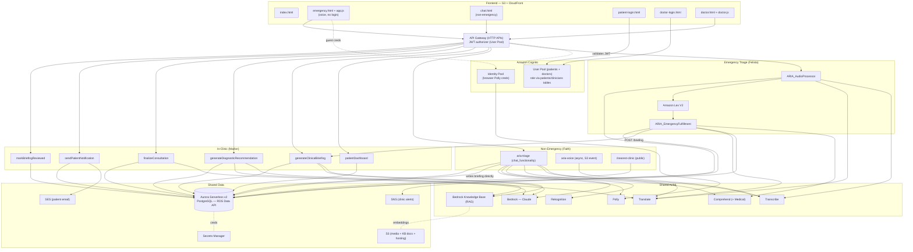

# Project ARIA — System Architecture

Whole-system view of ARIA (Accessible Real-time Intelligent Assistant) for
Mothobi Healthcare Group. Three services integrate through one shared Aurora
database. This is the reference for the architecture diagram and pitch.

> AWS Tech U capstone (Group 3). Proof-of-concept — not for real clinical use.

---

## Services by owner

| Service | Owner | Gateway | Purpose |
|---------|-------|---------|---------|
| **Emergency Triage** | Felista | HTTP API | Voice-first emergency intake → severity → alert + briefing |
| **Non-Emergency Consultation** | Faith | HTTP API | Authenticated chat/voice/image triage → routing + briefing |
| **In-Clinic Service** | Marlon | HTTP API | Doctor dashboard: briefing → diagnosis → prescription → patient email |

All gateways are HTTP APIs. (Multiple gateway IDs exist; treat as one logical
API layer with a Cognito JWT authorizer.)

---

## System diagram (Mermaid)

---

## Integration facts (keep the diagram honest)

- **`clinical_briefings` has two writers:**
  - Non-emergency (Faith) writes the briefing **directly** (its own Bedrock call) at escalation / one-shot triage.
  - Emergency (Felista) calls the in-clinic **`POST /briefing`** (RAG-grounded).
  - The doctor can **regenerate** a KB-grounded briefing on demand via `POST /briefing`.
  - All paths set `viewed_by_clinician = false`, so every briefing appears in the doctor queue.
- **The doctor dashboard is the single sink** for briefings from all triage paths.
- **One Cognito User Pool** (`us-east-1_7EcteStu9`, client `2naufa434t15vjrrl7aru34fqr`) for **both** patients and doctors. The distinction is role/provisioning — `patients.cognito_user_id` vs `clinicians.cognito_user_id` — resolved via `/clinician/whoami`. A separate **Identity Pool** provides browser Polly credentials for the (unauthenticated) emergency page.
- **One shared Aurora DB** is the integration hub: every Lambda reads/writes it via the RDS Data API; credentials in Secrets Manager. Schema changes are additive/coordinated.
- **`/nearest-clinic`** is a single public endpoint (Faith) consumed by both the non-emergency and the anonymous emergency pages.
- **Tables:** `notifications` (clinic-facing alerts) and `patient_notifications` (in-clinic patient email) are distinct — no collision.
- **RAG / Knowledge Base** is specific to the in-clinic briefing/diagnosis. Non-emergency uses Bedrock (Claude + vision) without the KB.
- **In-clinic `/briefing` will add Comprehend Medical** for entity extraction feeding retrieval (planned).

---

## AWS services (system-wide)

S3, CloudFront, API Gateway (HTTP API), AWS Lambda, Amazon Cognito (User Pool +
Identity Pool), Amazon Lex V2, Amazon Transcribe, Amazon Translate, Amazon
Comprehend (+ Comprehend Medical), Amazon Rekognition, Amazon Polly, Amazon
Bedrock (Claude), Bedrock Knowledge Bases (RAG), Aurora Serverless v2
(PostgreSQL, RDS Data API), Secrets Manager, Amazon SNS, Amazon SES, IAM,
CloudWatch.

---

## Key cross-cutting trade-offs

- **Shared relational DB (Aurora) over per-service stores** — clean integration and referential integrity across patients/sessions/messages/briefings; cost is coordinated schema changes (kept additive).
- **RAG over fine-tuning** (in-clinic) — auditable, instantly updatable clinical grounding.
- **Human-in-the-loop** — AI is decision-support; the clinician accepts/modifies/rejects and must approve before any patient notification is sent.
- **Multiple API gateways** — convenient per-owner, but CORS/authorizers must be configured per gateway (a missed CORS config surfaced only in the browser).
- **Known limitations (future work):** prescribing is doctor-entered (no AI drug selection, no allergy/interaction checking); SES/SMS in sandbox; sentiment→severity in emergency is a crude proxy for clinical acuity.
